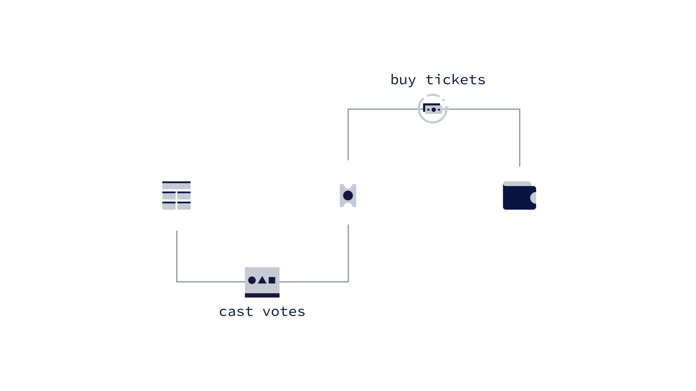
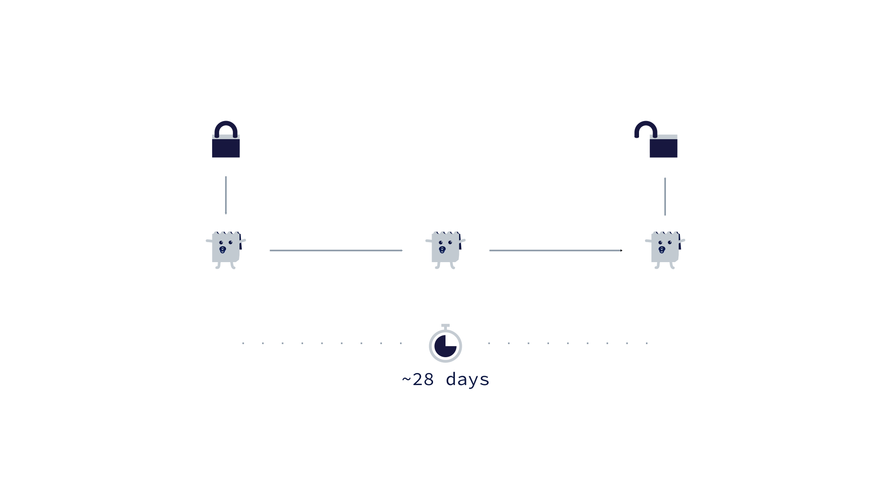
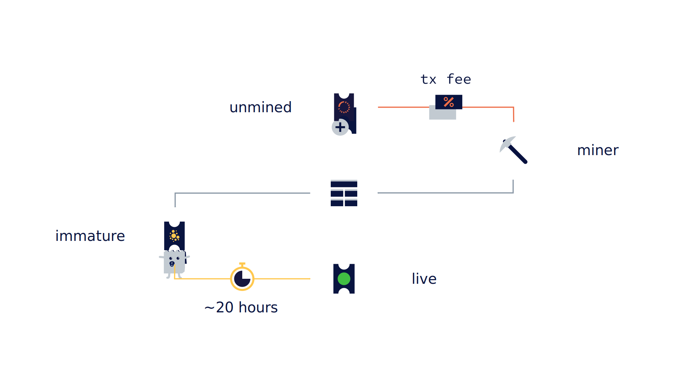
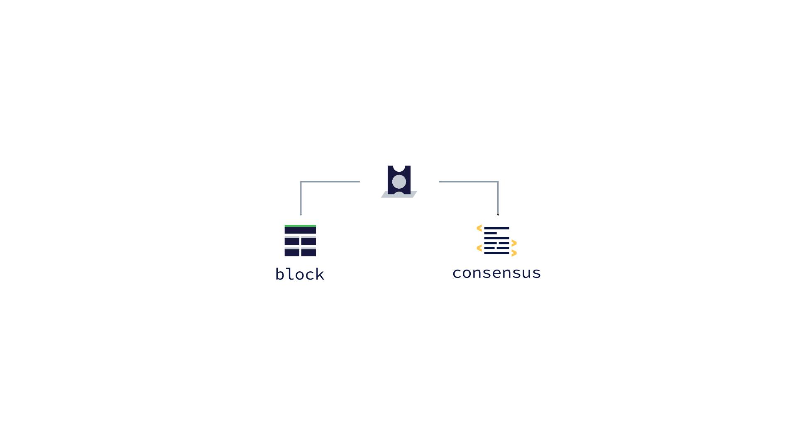
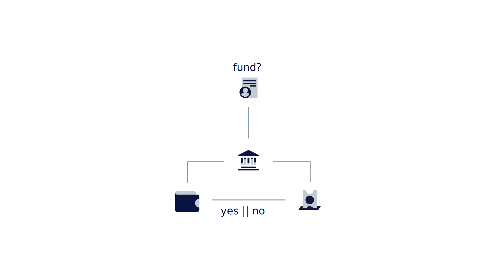
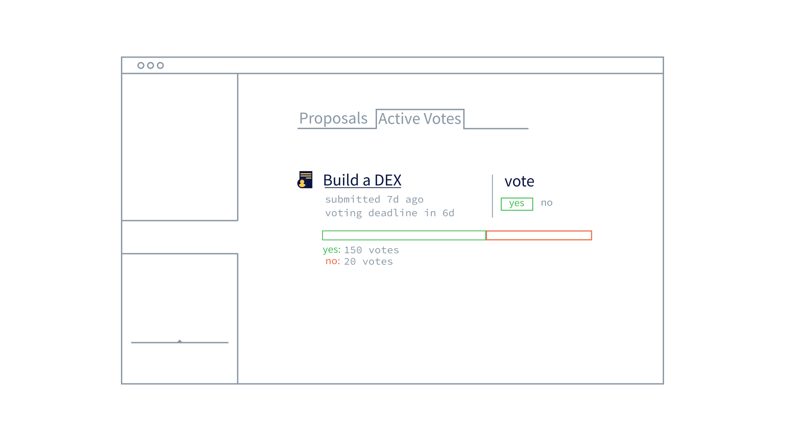

## Decred: Proof-of-Stake

### Storyboard
**Estimated Runtime:** 03:46

**Transition style:** Simple 'blink' on/off to give it a digital display feel.

No. | VISUAL | DESCRIPTION | TIME
:-: | :----: | :---- | :--:
1 |  | **VO:** Decred Proof-of-stake **action:** Ticket icon is highlighted. | 00:03 
2 |  | **VO:** is an on-chain decision making system **action:** "on-chain" and block icon appear first then "decision" and votes icon. They are then connected by the line. schematic cycles twice, adding a vote to the block icon each time. | 00:07 
3 |  | **VO:** Where participants purchase tickets for a chance to have their voice heard. **action:** Wallet icon appears pushing the schematic to the left, followed by the purchase ticket icon, pushing the schematic down. A line connects them and the schematic cycles filling the block icon with votes. | 00:12 
4 |  | **VO:** The price of a ticket is determined every 144 blocks by an algorithm designed to keep the total number of live tickets equal to the target size. **action:** Timer counts up to 144 blocks and activates the algorithm. Ticket count rapidly changes to above `40960`. Price is lowered. Timer counts up again. Count changes to below `40960` and price is increased. | 00:22 
5 |  | **VO:** to purchase a ticket, participants must have enough Decred to cover the current ticket price. **action:** `purchase ticket` button and icon are grey. `Available` counts up from zero. Then `ticket price`. `Purchase Ticket` button and icon turn green. | 00:28 
6 |  | **VO:** If the participant's balance is high enough, a portion equal to the current ticket price may be locked in exchange for a ticket. These locked funds can not be spent for the life of the corresponding ticket.  **action:** Purchase ticket button is pressed. purchase ticket screen slides to the left to show the tickets screen. `availabe` is subtracted by `ticket price.` `Locked` counts up. Ticket record slides up. Timer counts up in seconds. | 00:41 
7 |  | **VO:** How long a ticket must wait to vote is entirely up to chance, but averages 30 days. **action:** Bars slide in from left one by one, from bottom to top. Then average line. | 00:48 
8 |  | **VO:** A ticket's life begins after it is mined into a block. If the ticket is sent with a sufficient transaction fee, it will be mined into the next block. Miners can include up to 20 tickets in a block. Once mined, a ticket is considered immature and must wait about 20 hours before it becomes live and is added to the ticket pool. **action:** 1st half draws out and cycles, then emphasis on tx fee. Second half draws out. Entire schematic cycles. Timer counts up to 12 hours. | 01:07 
9 |  | **VO:** The ticket pool is where live tickets wait to be chosen to vote. About every 5 minutes, with the creation of each new block, 5 tickets are randomly selected from the pool. **action:** Timer counts up to 5 minutes. The 5 tickets turn green. | 01:20 
10 |  | **VO:** Once their ticket is drawn, a participant's votes are broadcast to the network by their chosen voting service provider for inclusion in the next block. **action:** Schematic cycles up and around. | 01:29 
11 |  |**VO:** In rare instances when a ticket expires before being drawn or the vote is 'missed' due to not being broadcast on time, the ticket is revoked and the corresponding funds are unlocked so the participant can purchase another ticket. **action:** Draw `not drawn` first (timer counts up to 4 months), then `drawn` (broadcast icon animated slowly), then `revoked` and `unlock funds`| 01:47 
12 |  | **VO:** There are two on-chain voting processes to participate in: block votes and consensus votes. **action:**  | 01:55 
13 |  | **VO:** Block votes provide a mechanism for participants to keep proof-of-work miners in check. **action:** schematic quickly 'cycles' multiple times over duration. | 02:02 
14 |  | **VO:** A 3 out of 5 vote in each new block decides whether to accept or reject the previous block. If the block is rejected, the founding miner will not receive their part of the block reward. **action:** Blocks are added, voting the previous block yes/no for the duration. Each of the 5 votes are added to the middle block icon as green/orange headers. If the block is voted no, then it turns completely red. If yes, the block turns completely green and the `if yes` portion is highlighted and the reward chest opens. | 02:13 
15 |  | **VO:** Consensus voting is a two stage process where participants vote for or against the implementation of changes to the Decred network. **action:**  Schematic 'cycles' slowly. | 02:31 
16 |  | **VO:** Upon release of the new code to be voted on, proof of stake and proof of work nodes begin signaling they have upgraded. Once a majority is upgraded, voting is scheduled to begin. **action:**  Schematic cycles `no` first, then `yes` | 02:40 
17 |  | **VO:** After voting begins, votes are collected over the next 4 weeks to be tallied. If 90% of votes are abstaining, then a revote occurs. Else, if  75% of non abstaining votes signal yes, then the changes to the network will be automatically activated after a 4 week grace period. **action:** Schematic cycles `abstain` first, then `yes`. | 03:03 
18 |  | **VO:** After a participant's vote has been cast and a 21 hour waiting period has elapsed, the funds used to purchase the voted ticket are unlocked and a portion of the block reward is credited to their account. **action:** An event:  `ticket voted` is added. followed by  `unlock funds`. Timer counts down from 12 hours. `pending` turns to confirmed. `locked` counts down into available. Another event is added `+  1.22019340 dcr` | 03:16 
19 |  | **VO:** Additionally, live tickets give access to voting through Politeia, Decred's public chain-anchored proposal system where anyone can propose new ideas  **action:** Proposals slide up onto the screen. | 03:25 
20 |  | **VO:** to be voted on by proof of stake participants to decide the path of Decred's future development. **action** `yes` vote is chosen. The green bar gets a little longer and `yes` vote count goes up by 1. | 03:32 
21 |  | **VO:** To begin participating in Decred proof-of-stake | 03:35 
22 |  | **VO:** download Decrediton at Decred.org | 03:38 
23 |  | **VO:** and purchase Decred at any one of the many supporting exchanges. | 03:43 
24 |  | **VO:** Decred; Decentralized Credits. | 03:46 
