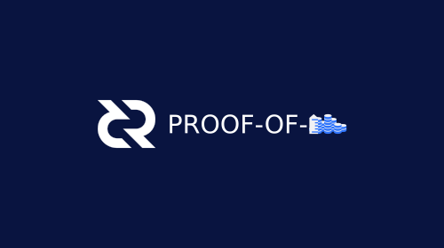
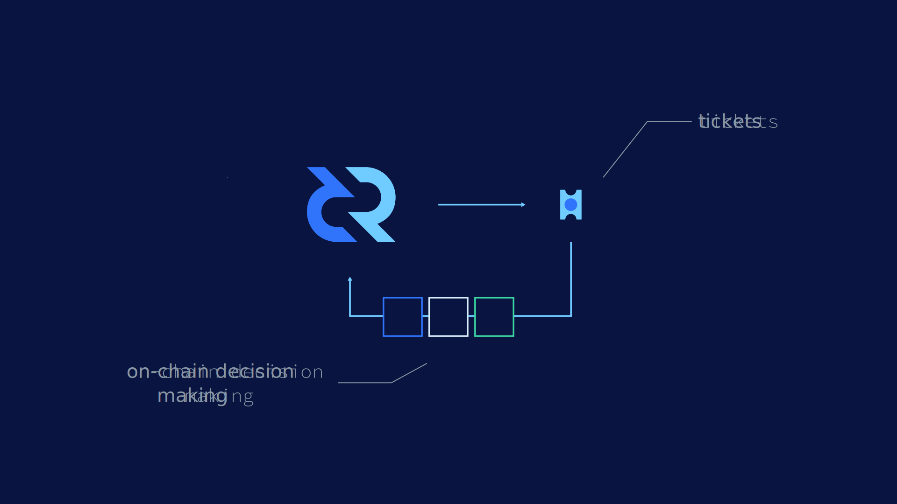
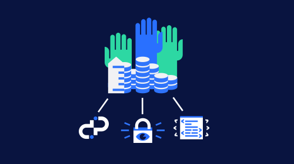
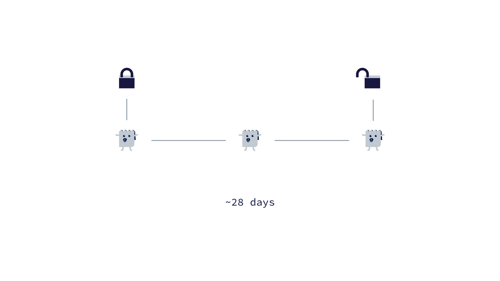
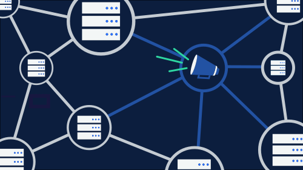
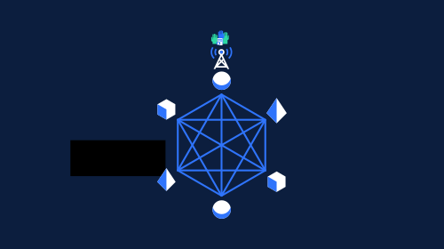
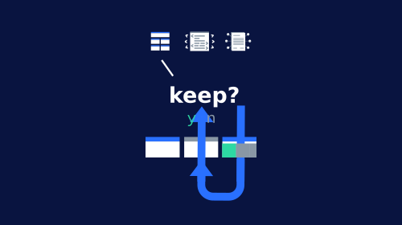
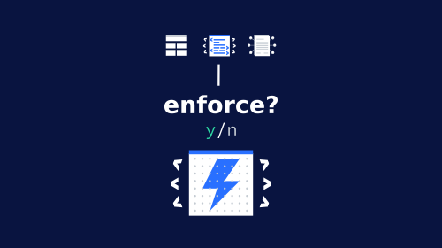
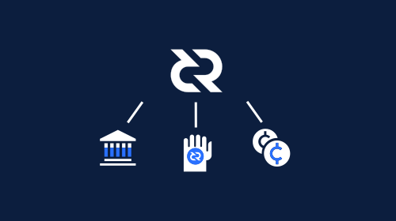
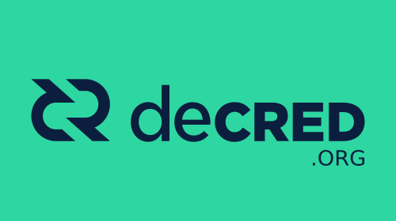

## Decred: Proof-of-Stake

### Storyboard
**Estimated Runtime:** 1.8 minutes

No. | VISUAL | AUDIO | TIME
:-: | :----: | :---: | :--:
1 |  | Decred proof-of-stake | 3 
2 |  | is an on-chain decision making system | 5 
3 |  | Where stakeholders purchase tickets for a chance to have their voice heard. | 6 
4 |  | to purchase a ticket, stakeholders must have enough Decred to cover the current ticket price. | 3 
5 |  | Every 144 blocks, a new ticket price is calculated by a pricing algorithm to keep the total number of active tickets equal to the target size. | 3 
6 |  | if the stakeholder's balance is high enough, a portion equal to the calculated ticket price may be locked in exchange for a ticket. | 7
7 |  | Locked funds can not be spent for the duration of the ticket lifecycle. | 5 
8 |  | How long an individual ticket lives for is up to chance. | 3 
9 |   | a ticket holder's votes are broadcast | 3
10 |  | to the network by their chosen vote casting service. | 5
11 |  | Proof-of-stake voters can cast block, consensus, and proposal votes. | 7 
12 |  | Block votes determine whether the previous block is wanted in order to preserve chain integrity. | 8 
13 |  | Consensus votes serve to ratify consensus rule changes. | 5 
14 |  | And Proposal votes go towards deciding which community sourced project proposals receive funding. | 7
15 |   | After a ticket holder's votes have been cast, the coins used to purchase the ticket are unlocked | 7 
16 |  | and a portion of the block reward is credited to their account. | 4
17 |  | Decred's proof-of-stake voting system, | 3 
18 |  | makes it an autonomous self-funded digital currency where stakeholders make the rules. | 7 
19 |  | To begin participating in the Decred network | 4 
20 |   | download Decrediton at Decred.org  | 4 
21 |   | and become a stakeholder by purchasing Decred at any one of the many supporting exchanges. | 6
22 |  | Decred; Decentralized Credits. | 3
