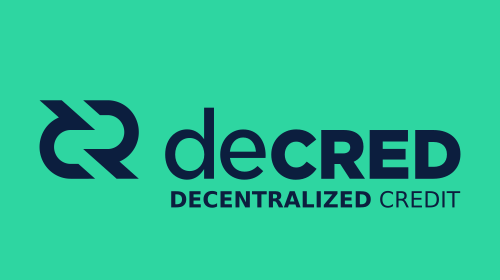

## Decred In Depth: Proof-of-Stake
### Storyboard
**Estimated Runtime:** 2.7 minutes

No. | VISUAL | DESCRIPTION | AUDIO | TIME
:-: | :----: | :---: | :---: | :--:
1 |  | Decred symbol, 'proof', '-of-', and coins symbol pop up as spoken. | Decred's proof-of-stake system | x
2 |  | icons pop out from coins as mentioned. | allows stakeholders to secure the network, award project funding, and change consensus rules | 14
3 |  | hands rise up from behind coins. | by voting with their coins. To take part in the proof-of-stake voting system, | 14
4 |  | Lock icon appears and coins turn from blue to grey. | stakeholders lock a portion of their coins | 4.5
5 |  | A rectangular slot opens beneath the coins which they fall down into. Out pops a ticket. | in exchange for a ticket. | 4.5
6 |  | The ticket slides into the open slot in the grid and tickets begin to randomly turn blue. | All tickets are placed in the ticket pool where they wait to be randomly selected. | 7
7 |  | A ticket fills the open spot and then then 5 random tickets light up. | Every 5 minutes, 5 tickets are drawn from the pool. Once their ticket is drawn | 6 
8 |  | A drawn ticket is inserted into a slot underneath. | Once their ticket is drawn, a ticket holder's votes | 5
9 |   | Out of the slot comes a broadcast tower which lights up blue as it broadcasts the ticketholders votes. | are broadcast by their chosen vote casting service which provides the infrastructure | 5
10 |  | A node broadcasts votes to the network, turning the lines blue. | to broadcast votes to the network swiftly, ensuring that they are included in the next block. | 8
11 |  | Icons pop out as mentioned. | Proof-of-stake voters can can cast block, consensus, and proposal votes. | 7
12 |  |  | Block votes determine whether the previous block is wanted. | 10 
13 |  |  | If a block is unwanted, it is stripped from the network and the miner who found it receives no reward. This gives stakeholders a mechanism to check miner behavior and stop unwanted forks. | 12
14 |  | **text:** *Implement lightning? y/n* | Consensus votes take place over a defined period of time and serve to ratify consensus rule changes. | 7
15 |  | x | x | 13
16 |  | x | And Proposal votes decide which community sourced project proposals receive funding from the network fund. | 7
17 |  | x | x | 14
18 |  | x | x | 5
19 |   | lock unlocks and coins turn from grey to blue. | After a ticket holder's votes have been cast, the coins used to purchase the ticket are unlocked | 6
20 |  | x | and a portion of the block reward is credited to their account. | 4
21 |  | x | x | 5
22 |   | Decred symbol | Thanks to its unique proof-of-stake voting system, | 4
23 |  | Icons representing *autonomous, self-funded, currency*. | Decred is an autonomous self-funded crypto-currency where stakeholders make the rules. | 5
24 |  | Decred symbol. | To begin participating in the Decred network | 3
25 |   | Decred symbol and wallet icon | download Decrediton at Decred.org  | 4 
26 |   | Decred symbol and exchange icon | and purchase Decred at any one of the many supporting exchanges. | 6
27 |  | Decred logo. **text:** *Decentralized Credits.* | Decred; Decentralized Credits. | 3
