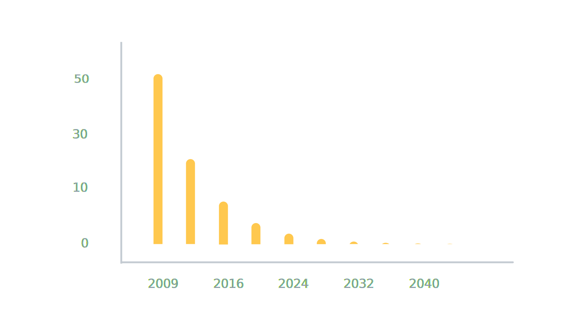
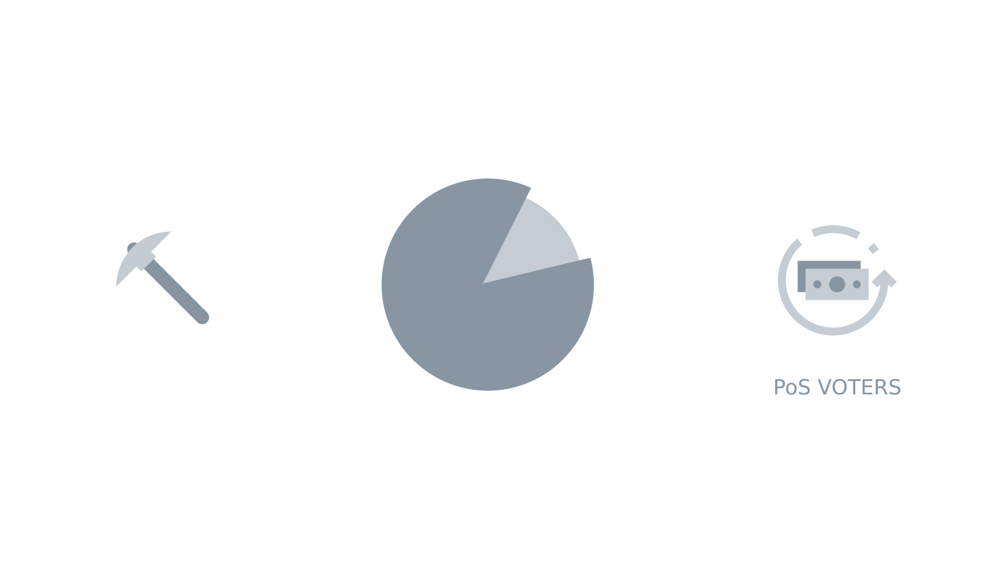

#How Decred Is Unique

### Storyboard
**Estimated Runtime:**

No. | VISUAL | AUDIO | TIME
:-: | :----: | :---: | :--:
1 |  | Decred builds upon the strengths of Bitcoin to create a community driven cryptocurrency with open governance and sustainable funding for development. To see how Decred achieves this, let's compare it to Bitcoin. |  |
2 |  | For starters, both Bitcoin and Decred have a 21 million coin supply cap. |  |
3 |  | Here's where things get interesting. Bitcoin's block reward is reduced by 50 percent every 4 years as shown by this stepped graph. |  |
4 |  | Decred's block reward is reduced smoothly and gradually by 1% every 21 days as shown by this curve. |  |
5 |  | Every 10 minutes on average, new Bitcoin blocks are found and broadcast by proof-of-work miners, who also receive 100% of the Bitcoin block reward. Decred blocks are found and broadcast every 5 minutes on average by proof-of-work miners who only receive part of the Decred block reward. Here's why: |  |
6 |  | Decred utilizes a hybrid proof-of-work - proof-of-stake protocol where 90% of Decred's block reward is split between proof-of-work Miners and participating stakeholders called Proof-of-stake Voters. Miners receive 60% of the total block reward for finding Decred blocks while Voters receive 30% for casting on-chain votes. It works like this: |  |
7 |  | With each new Decred block 5 stakeholders are chosen to cast 5 on-chain votes. These votes, called block votes, are used to decide whether to accept or reject the previous block. |  |
8 |  | If a majority decides to reject the block, its miner is stripped of their portion of the block reward as punishment for breaking the rules. |  |
9 |  | By allowing the rejection of blocks, Decred's hybrid protocol provides a mechanism for stakeholders to prevent miner attacks and unwanted hard forks, giving them sovereignty over the Decred chain. |  |
10 |  | Since Bitcoin employs a pure Proof-of-work protocol, sovereignty over its chain is firmly in the hands of Bitcoin miners, leaving Bitcoin stakeholders powerless. The differences don't stop there. |  |
11 |  | The remaining 10% of the Decred block reward is placed in the Decred Treasury. |  |
12 |  | The Treasury makes Decred a self-funded open source project with no need for outside capital or an ICO. |  |
13 |  | How the funds in the Treasury are spent is also determined by participating stakeholders. |  |
14 |  | Through Politeia, the Decred proposal system, anyone can shape the future of Decred by proposing new ideas for stakeholder consideration. All proposals must be approved by stakeholders, giving them sovereignty over Decred's development. |  |
15 |  | Decred is a community driven cryptocurrency with open governance and sustainable funding for development.  |  |
16 | text: Decred.org/community & community logos | To become part of the Decred community go to Decred.org/community and join the discussion through your favorite supported social platform. |  |
17 | credits and PoS video card | To learn more about Decred's Proof-of-stake voting system, check out our in depth video on the subject. |  |
18 | Logo | Decred; Decentralized Credits |  |
