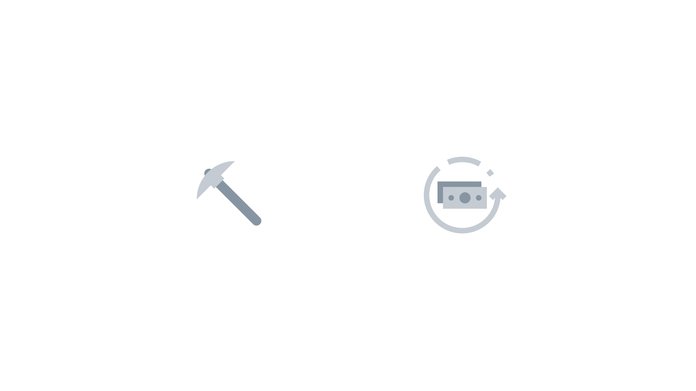
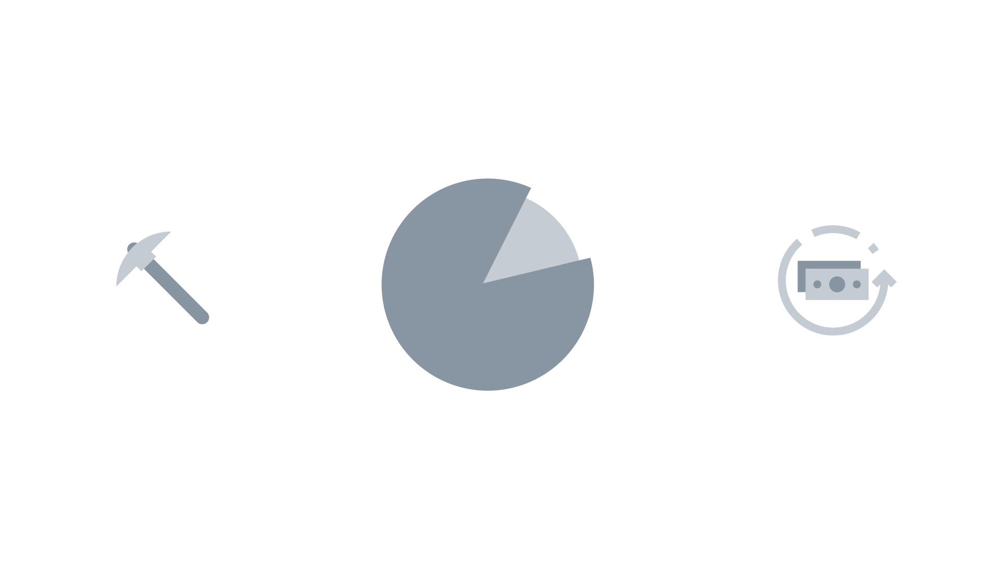
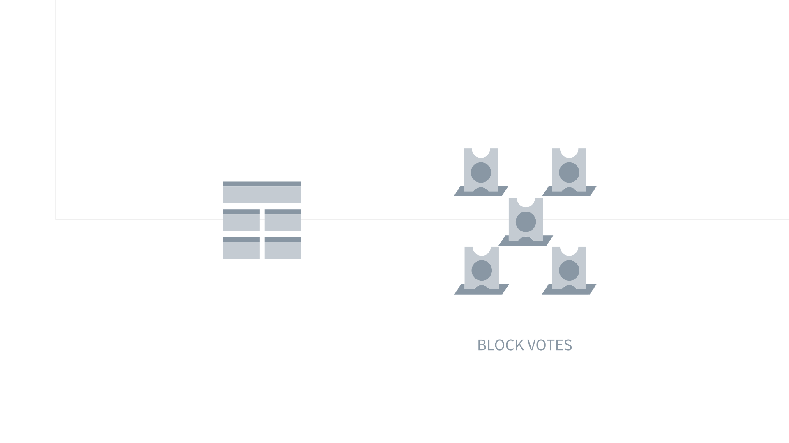
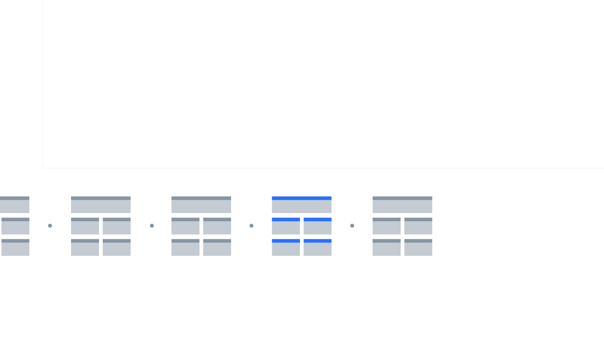

## How Decred Is Unique

### Storyboard
**Runtime:** 00:02:50

| No. | VISUAL | AUDIO | TIME |
| :-: | :----: | :---- | :--: |
| 1 |  | **VO**: Decred builds upon the strengths of Bitcoin to create **Action**: Logo animation. | 0:00 |
| 2 |  | **VO**: a community driven **Action**: Icon animation. | 0:03 |
| 3 |  | **VO**: cryptocurrency **Action**: Icon animation | 0:04 |
| 4 |  | **VO**: with open governance **Action**: Icon animation. | 0:05 |
| 5 |  | **VO**: and sustainable funding for development.To see how Decred achieves this, lets compare it to Bitcoin. **Action**: Icon animation. | 0:06 |
| 6 |  | **VO**: For starters, both Bitcoin and Decred have a 21 million coin supply cap. **Action**: Yellow lines stretch up first, followed by blue lines. | 0:13 |
| 7 |  | **VO**: Here's where things get interesting. Bitcoin's block reward is reduced by 50 percent every 4 years as shown by this stepped graph. **Action**: All lines start at same top height, then fall down. Camera pans right. | 0:17 |
| 8 |  | **VO**: Decred's block reward is reduced smoothly and gradually by 1% every 21 days as shown by this curve. **Action**: All lines start at same top height, then fall down. Camera zooms out. | 0:26 |
| 9 |  | **VO**: New Bitcoin blocks are found and broadcast by proof-of-work miners, who also receive 100% of the Bitcoin block reward. Decred blocks are found and broadcast by proof-of-work miners who only receive part of the Decred block reward. Here's why: **Action**: Black lines move up from bottom to show PoW Reward portions. | 0:33 |
| 10 |  | **VO**: Decred utilizes a hybrid proof-of-work - proof-of-stake protocol **Action**:  Miner animation in, then PoS animation in. | 0:47 |
| 11 |  | **VO**: where 90% of Decred's block reward is split between **Action**: Gray circle animates in pushing the other icons outward. 90% wedge increases size and turns dark gray to highlight. | 0:52 |
| 12 |  | **VO**: proof-of-work Miners and participating stakeholders called **Action**: Text in. | 0:55 |
| 13 |  | **VO**: Proof-of-stake Voters. **Action**: Previous text out, new text in. | 0:58 |
| 14 |  | **VO**: Miners receive 60% of the total block reward for finding Decred blocks while Voters **Action**: 60% wedge and miner highlight blue. The 40% portion of wedge reduces to initial size. | 1:00 |
| 15 |  | **VO**: receive 30% for casting on-chain votes. **Action**: 40% wedge size increases and turns blue. 60% wedge size decreases and turns gray. | 1:04 |
| 16 |  | **VO**: It works like this: **Action**: Miner moves to center. Pie chart and PoS animate out. | 1:07 |
| 17 |  | **VO**: With each new Decred block **Action**: Pickaxe swings and produces a block. | 1:09 |
| 18 |  | **VO**: 5 stakeholders are chosen **Action**: Stakeholders animate in, pushing block to the left. | 1:11 |
| 19 |  | **VO**: to cast 5 on-chain votes. **Action**: Stakeholders flip and become votes. | 1:12 |
| 20 |  | **VO**: These votes, called block votes, **Action**: Text in. | 1:14 |
| 21 |  | **VO**: are used to decide whether **Action**: Votes condense and block moves right to 'absorb them'. The block turns blue and begins to 'fall' | 1:17 |
| 22 |  | **VO**: to accept or reject **Action**: The block falls to the head of the blockchain, producing a wave in the chain. | 1:18 |
| 23 |  | **VO**: the previous block. **Action**: Previous block turns blue. | 1:20 |
| 24 |  | **VO**: If a majority decides to reject the block, **Action**: Votes flip out of the new block. The previous block turns red. | 1:21 |
| 25 |  | **VO**: its miner is stripped **Action**: Camera pans down to red miner icon. | 1:23|
| 26 |  | **VO**: of their portion of the block reward **Action**: Pie chart animate in on top of miner icon. the 60% portion is highlighted red. | 1:25 |
| 27 |  | **VO**: as punishment for breaking the rules. **Action**: The 60% wedge 'implodes' and turns white. | 1:26 |
| 28 |  | **VO**: By allowing the rejection of blocks, Decred's hybrid protocol provides a mechanism **Action**: Pickaxe swings, producing blocks that move right to be 'absorbed' by the Decred logo. | 1:28 |
| 29 |  | **VO**: for stakeholders to prevent miner attacks and unwanted hard forks, giving them sovereignty over the Decred chain. **Action**: Stakeholder slides between the miner and logo. Blue blocks pass through, gray blocks fall down off screen. | 1:33 |
| 30 |  | **VO**: Since Bitcoin employs a pure Proof-of-work protocol, sovereignty over its chain is firmly in the hands of Bitcoin miners, **Action**: Pickaxe swings producing yellow and gray blocks which are 'absorbed' by the Bitcoin logo. | 1:40 |
| 31 |  | **VO**: leaving Bitcoin stakeholders powerless. The differences don't stop there. **Action**: Stakeholder slides down to right of Bitcoin logo. | 1:47 |
| 32 |  | **VO**: The remaining 10% of the Decred block reward is placed in the Decred Treasury. **Action**: Pie chart animates in and highlights 10% wedge. Simultaneously, wallet icon animates in. Finally, text in on mention. | 1:52 |
| 33 |  | **VO**: The Treasury makes Decred a self-funded open source project with no need for outside capital or an ICO. How the funds in the Treasury are spent **Action:** Text and pie chart out. Spinning circle and logo in from bottom. Circle is green when arrow is pointing up and red when pointing down. | 1:56 |
| 34 |  | **VO**: is also determined by participating stakeholders. **Action**: Stakeholder in. | 2:05 |
| 35 |  | **VO**: Through Politeia, the Decred proposal system, anyone can shape the future of Decred **Action**: Pi logo in from bottom pushing previous up and off screen. Text in on mention. | 2:08 |
| 36 |  | **VO**: by proposing new ideas for stakeholder consideration. **Action**: Proposal in from bottom pushing text up and off screen. | 2:13 |
| 37 |  | **VO**: All proposals must be approved by stakeholders, **Action**: Stakeholder in from bottom pushing pi logo up and off screen. | 2:16 |
| 38 |  | **VO**: giving them sovereignty over Decred's development. **Action**: Pi icon appears, then proposals icon, then stakeholder icon. **Action**: Roadmap icon in from bottom pushing proposal icon up and off screen. | 2:19 |
| 39 |  | **VO**: Decred is a community driven **Action**: Icon in. | 2:22 |
| 40 |  | **VO**: cryptocurrency **Action**: Icon in. | 2:24 |
| 41 |  | **VO**: with open governance **Action**: Icon in. | 2:25 |
| 42 |  | **VO**: and sustainable funding for development. **Action**: Icon in. | 2:26 |
| 43 |  | **VO**: To become part of the Decred community go to Decred.org/community and join the discussion through your favorite supported social platform. **Action**: User group icon moves to center. Others animate out. Text in from bottom on mention, pushing user group icon up. | 2:29 |
| 44 |  | **VO**: To learn more about Decred's Proof-of-stake voting system, check out our in depth video on the subject. **Action**: crossfade in. Fade out. | 2:36 |
| 45 |  | **VO**: Decred; Decentralized Credits **Action**: logo animation in. | 2:42 |